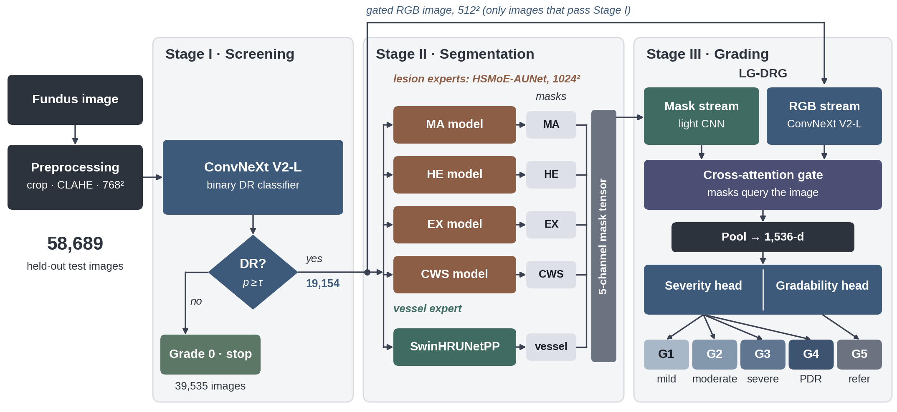

# HierarchiRetina

**A screening–segmentation–grading cascade for diabetic retinopathy, evaluated end-to-end.**

This repository contains the code for the manuscript *"HierarchiRetina: A Screening–Segmentation–Grading
Cascade for Diabetic Retinopathy with Heterogeneous Mixture-of-Experts Lesion Segmentation, Evaluated
End-to-End"* (submitted to IEEE Journal of Biomedical and Health Informatics).



## 1. What the cascade does

| Stage | Model | Task | Main result (held-out data) |
|---|---|---|---|
| I | ConvNeXt V2-L at 768 × 768 | DR present (grades 1–5) vs. no DR | AUC 0.929; sensitivity 0.854, specificity 0.887 |
| II | **HSMoE-AUNet** (one model per lesion) | MA, HE, EX and CWS segmentation at 1024 × 1024 | pooled Dice EX 0.579, HE 0.510, CWS 0.408, MA 0.184 |
| II | **SwinHRUNetPP** | retinal vessel segmentation at 512 × 512 | pooled Dice 0.731 |
| III | **LG-DRG** (5-fold ensemble) | gradability (Grade 5) + ordinal severity (Grades 1–4) | out-of-fold QWK 0.781 (tuned); ungradable AUC 0.999 |
| All | cascade | end-to-end grading of 58,689 test images | QWK 0.804 (95% CI 0.798–0.809) |

1. **Stage I** screens every image. Images below the gate threshold (τ = 0.2392) are returned as Grade 0
   and are never segmented or graded.
2. **Stage II** segments only the images that pass the gate: four HSMoE-AUNet models (sparse
   mixtures of *heterogeneous* experts in the skip, bottleneck and decoder blocks, with lesion-matched
   expert pools) and the SwinHRUNetPP vessel model. The five binary masks form the mask input of Stage III.
3. **Stage III (LG-DRG)** takes the RGB image and the five masks, separates gradability from severity
   with two heads, and decodes the rank-consistent ordinal head with thresholds fitted on
   out-of-fold predictions only.
4. **Evaluation** counts every screening miss as a final grading error and attributes each error to
   the stage that caused it.

## 2. Repository layout

```
HierarchiRetina/
├── hierarchiretina/            # importable package: all model, data, training and metric code
│   ├── stage1/                 # screening gate: preprocessing, model, losses, training, evaluation, routing
│   ├── stage2/                 # HSMoE-AUNet (lesions) and SwinHRUNetPP (vessels)
│   └── stage3/                 # LG-DRG, CORN decoding, OOF calibration, cascade evaluation, ablation
├── notebooks/                  # thin, numbered notebooks that run each step of the paper
│   ├── stage1_screening/
│   ├── stage2_segmentation/
│   ├── stage3_grading/
│   └── cascade/
├── docs/overview.png
├── requirements.txt
└── pyproject.toml
```

The notebooks hold the configuration and call the package; the package holds the logic. Every notebook
starts with one configuration cell containing all paths, relative to the repository root.

## 3. Installation

```bash
git clone https://github.com/asifuddin01/HierarchiRetina.git
cd HierarchiRetina
conda create -n hierarchiretina python=3.10 -y && conda activate hierarchiretina
pip install torch torchvision --index-url https://download.pytorch.org/whl/cu121   # match your CUDA
pip install -e .
pip install jupyter
```

Start Jupyter **from the repository root** so the relative paths in the notebooks resolve.
ImageNet weights for the backbones are downloaded by `timm` on first use. Training was done on one
NVIDIA RTX A6000 (48 GB).

## 4. Data

All datasets are public or available from their providers on request; they are not redistributed here.

* **Grading (Stages I and III):** EyePACS, DDR, APTOS 2019, Messidor-2, FGADR and IDRiD. Official test
  partitions are used where they exist (EyePACS, DDR, IDRiD). APTOS 2019 has no labelled official test
  split and was split 80/10/10 at random; Messidor-2 and FGADR were split 85/15 once with a fixed seed.
  Test pool: 58,689 images. Development pool: 51,445 images.
* **Lesion segmentation (Stage II):** FGADR, MAPLES-DR, IDRiD and e-ophtha.
* **Vessel segmentation (Stage II):** DRIVE, STARE, HRF and MAPLES-DR (288 images).

Expected layout (create it, or edit the configuration cell of each notebook):

```
data/
├── train/train_grade.csv  +  train/train_image/       # development pool: image, grade (0-4, 5 = ungradable)
├── test/test_grade.csv    +  test/test_image/         # test pool (58,689 images)
├── stage2_lesions/raw/<MA|HE|EX|CWS>/{images,masks}/  # lesion image-mask pairs
├── vessel_dataset/{image,mask}/                       # vessel image-mask pairs
└── stage3/dev_grades.csv  +  stage3/dev_images/       # DR-positive development images (grades 1-5)
```

Generated folders: `outputs/` (predictions, tables, routed images, masks) and `checkpoints/`.
Both are git-ignored.

## 5. Running the pipeline

Run the notebooks in this order. Each notebook explains its steps in numbered markdown cells.

| # | Notebook | What it produces |
|---|---|---|
| 1 | `stage1_screening/01_train_gate_768` | stratified 80/20 split; Stage I checkpoint |
| 2 | `stage1_screening/02_threshold_and_test_evaluation` | τ from validation (argmax 2·TPR − FPR); test metrics, calibration, Fig. 2 |
| 3 | `stage1_screening/03_route_test_pool` | `outputs/stage1_gate/dr_from_test/` (19,154 images) and `data/test/stage1_manifest.csv` |
| 4 | `stage1_screening/04_baselines_and_equal_load_comparison` | Stage I comparison table (SwinV2-L 384, ConvNeXt V2-L 512, folds, hybrid) |
| 5 | `stage2_segmentation/01_prepare_lesion_data` | filtered, cropped lesion data and the 70/20/10 split (per lesion) |
| 6 | `stage2_segmentation/02_train_hsmoe_aunet` | one HSMoE-AUNet per lesion (`LESION = "MA" \| "HE" \| "EX" \| "CWS"`) |
| 7 | `stage2_segmentation/03_lesion_threshold_and_test_metrics` | validation threshold sweeps; lesion rows of the segmentation table |
| 8 | `stage2_segmentation/06_train_swinhrunetpp_vessels` | vessel split and SwinHRUNetPP checkpoint |
| 9 | `stage2_segmentation/07_vessel_test_metrics` | vessel row of the segmentation table |
| 10 | `stage2_segmentation/04_generate_lesion_masks` | lesion masks for routed test images and development images |
| 11 | `stage2_segmentation/08_generate_vessel_masks` | vessel masks (same folders) |
| 12 | `stage2_segmentation/05_overlap_with_grading_test` | overlap between Stage II training data and the grading test pool |
| 13 | `stage3_grading/01_train_lgdrg_5fold` | five LG-DRG fold models |
| 14 | `stage3_grading/02_oof_predictions_and_threshold_calibration` | out-of-fold table; CORN thresholds fitted on OOF only |
| 15 | `stage3_grading/03_test_inference_ensemble` | 5-fold ensemble predictions on the routed test images |
| 16 | `cascade/01_end_to_end_evaluation` | end-to-end results, error attribution, bootstrap CIs, per-dataset table |
| 17 | `cascade/02_gate_threshold_sweep` | end-to-end QWK vs. gate threshold (Fig. 5) |
| 18 | `cascade/03_ddr_benchmark_protocols` | DDR five- and six-class protocols |
| 19 | `cascade/04_mask_ablation_and_gamma_fix` | mask-reliance ablation and the fold-0 γ experiment |

Notebooks 16–18 need only the per-image prediction CSVs and run on a CPU in under a minute.

Mask files follow the naming LG-DRG reads: `<root>/<lesion>/<stem><suffix>.png`, with suffixes
`ma: _mask`, `he: _he_mask`, `ex: _ex_mask`, `cws: _cws_mask`, `vessel: _mask` (binary, 0/255, original
image size).

## 6. Reproducibility notes

The code reproduces what was run for the paper, including details that are easy to miss. Model
classes keep the original attribute names, so the trained checkpoints load with `strict=True`.

1. **Gate threshold.** τ = 0.2391715943813324 (full precision) routes 19,154 test images; the rounded
   0.2392 routes 19,153 and is used for the equal-load comparison.
2. **HSMoE-AUNet encoder initialisation.** The model's weight-initialisation routine runs over all
   modules after `timm` loads the ConvNeXt-S weights, so the encoder's convolution and linear weights are
   re-initialised (only normalisation and layer-scale parameters keep their pretrained values). This is
   kept as trained.
3. **HSMoE-AUNet batch size.** MA used batch 4 × accumulation 4; HE, EX and CWS used batch 2 ×
   accumulation 4. Per-lesion settings (expert pools and counts, loss terms, learning rates, schedulers,
   thresholds, test-time flips) are collected in `hierarchiretina.stage2.hsmoe_aunet.LESION_CONFIGS`.
4. **LG-DRG learning-rate schedule.** The warm-up/cosine schedule is sized in batches but stepped once
   per optimiser update (gradient accumulation 8), so warm-up lasts about 24 epochs and the cosine
   phase barely starts within 60 epochs. Kept on purpose; see `hierarchiretina.stage3.engine`.
5. **LG-DRG ordinal loss.** For task k ≥ 1 the training subset is `y ≥ k − 1` (standard CORN uses
   `y ≥ k`). Kept as trained; the decode thresholds were fitted on out-of-fold predictions of these models.
6. **Library versions.** Augmentations use the Albumentations 1.x API; under 2.x some arguments
   (e.g. `CoarseDropout`, `GaussNoise`) are interpreted differently. Pin `albumentations<1.5` to match the
   paper runs. Checkpoint key names depend on `timm` 1.0.x.
7. **Determinism.** Seeds are fixed (42) for all splits; GPU training is not bit-for-bit deterministic.

## 7. Trained models and predictions

Trained weights and the per-image prediction files used for every table will be released on the
repository's Releases page.

## 8. Citation

A citation entry will be added when the paper is published.

## 9. License

MIT License; see [LICENSE](LICENSE). The datasets keep their own licences and terms of use.
